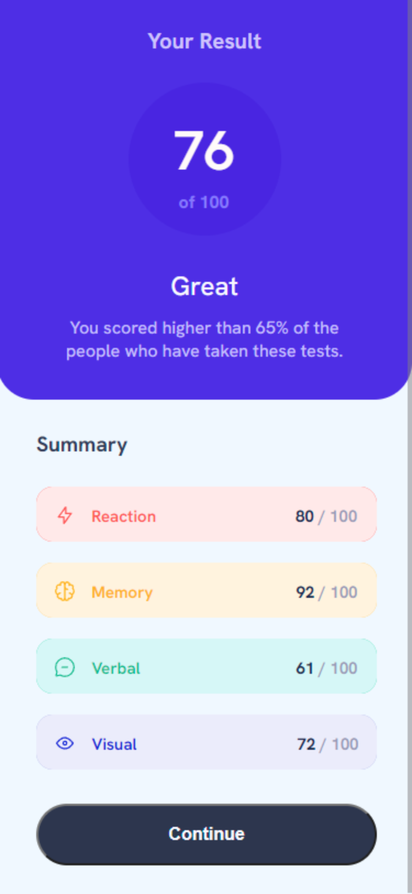

# Frontend Mentor - Results summary component solution

This is a solution to the [Results summary component challenge on Frontend Mentor](https://www.frontendmentor.io/challenges/results-summary-component-CE_K6s0maV). Frontend Mentor challenges help you improve your coding skills by building realistic projects. 

## Table of contents

  - [Overview](#overview)
  - [The challenge](#the-challenge)
  - [Screenshot](#screenshot)
  - [Links](#links)
  - [My process](#my-process)
  - [Built with](#built-with)
  - [Other tools used](#other-tools-used)
  - [What I learned](#what-i-learned)
  - [Useful resources](#useful-resources)

## Overview

### The challenge

Users should be able to:

- View the optimal layout for the interface depending on their device's screen size
- See hover and focus states for all interactive elements on the page
- **Bonus**: Use the local JSON data to dynamically populate the content

### Screenshot

![]
![]


### Links

- Solution URL: [Add solution URL here](https://your-solution-url.com)
- Live Site URL: [Add live site URL here](https://your-live-site-url.com)

## My process

### Built with

- Semantic HTML5 markup
- CSS custom properties
- Flexbox
- CSS Grid
- Mobile-first workflow  


### Other tools used:
- Pesticide extension -> this is perfect to outline eacth element to better see the placement on the page  
- Developer tools -> available on any browser and is ideal for experimenting with changes to your page without affecting your code
- Imagecolorpicker -> used to choose a color and obtain the corresponding HTML Color Code for the selected pixel of an uploaded picture
- Convertingcolors -> perfect for converting colors and getting all the details about the converted color

### What I learned

1. Utilizing Flexbox properties to centrally align content: 
```css
.content {
    display: flex; /* Flexbox layout: Displays children in a flexible container */
    flex-wrap: wrap; /* Allows wrapping of flex items within the container */
    align-items: flex-end; /* Aligns flex items along the cross axis to the bottom */
    justify-content: center; /* Centers flex items along the main axis */
}
```

2. Adjusting the display behavior of a circular element to flow inline with text and other inline elements, while preserving its circular shape and block-level space:
```css
.circular {
  display: inline-block;
}
```

3.Employing the z-index property to manage the stacking order of overlapping HTML elements:
a. for desktop view :
```css
.result-section {
 z-index: 1;
 top: 0; 
 left: 54px; 
}
```
b. for mobile view:
```css
.result-section {
 z-index: 2;
 margin: 0;
  top: -92px;
  left: 11px;
}
```
4.Applying an inside box-shadow for a distinctive effect: 
```css
.reaction-section {
    box-shadow: inset 5em 5em #ffe9e9;
}
```

5. Aligning and centering text with its icon while creating space between them:
```css
.reaction-section p {
display: inline-block; 
margin-left: 10px;
padding-top: 0.5em;
padding-bottom: 0.5em;
}
```

6.Starting content at the edge of the screen by removing margins and padding from HTML and body elements, and preventing horizontal overflow for mobile view:
```css
html, body {
        overflow-x: hidden; /* Prevent horizontal overflow */
        margin: 0;
        padding: 0;
    }
```

7. Positioning and styling a container to eliminate extra space around and below it, achieving an overlapping effect with other elements:
```css
.summary-section {
        z-index: 1;
        position: relative;
        border-radius: 0px;
        top: -117px;
        margin-bottom: -119px;
        margin-left: 6px;
        height: calc(100vh - 335px);
        width: 108vw;
}
```

8.Implementing specific styles for Chrome browsers to ensure consistent layout, especially for mobile views
```css
@media screen and (-webkit-min-device-pixel-ratio:0) {
    /* Chrome-specific CSS rules */
    body {
        margin-left: -25px; /* Example adjustment for Chrome */
    }
}
```

9.Hiding the footer on mobile devices to optimize screen space:
```css
@media only screen and (max-width: 768px) {
    footer {
      display: none; 
    }
}
```


### Useful resources

- - [Example resource 1](https://developer.mozilla.org/en-US/) - This resource proved valuable to me when I had to search for specific HTML or CSS elements for my project. I highly recommend this site to anyone looking to initiate their learning journey in HTML and CSS. It also offers a comprehensive set of learning materials tailored for novice developers and students.

- -  [Example resource 2](https://imagecolorpicker.com/) - This is perfect if you want to extract colors from images.

- - [Example resource 3](https://convertingcolors.com/) -  Useful for converting between various color formats such as HSL, RGB, and more. Additionally, it offers a range of other color-related tools and apps to assist in various tasks.

- -  [Example resource 4](https://developer.mozilla.org/en-US/docs/Web/CSS/box-shadow) - Provides detailed guidance on using the box-shadow property, including syntax, possible values, examples, and browser compatibility.


- -  [Example resource 5](https://www.sitepoint.com/) - Good to find a range of resources including articles, tutorials, books, and online courses covering various topics such as HTML, CSS, JavaScript, PHP, UX/UI design, and more.
